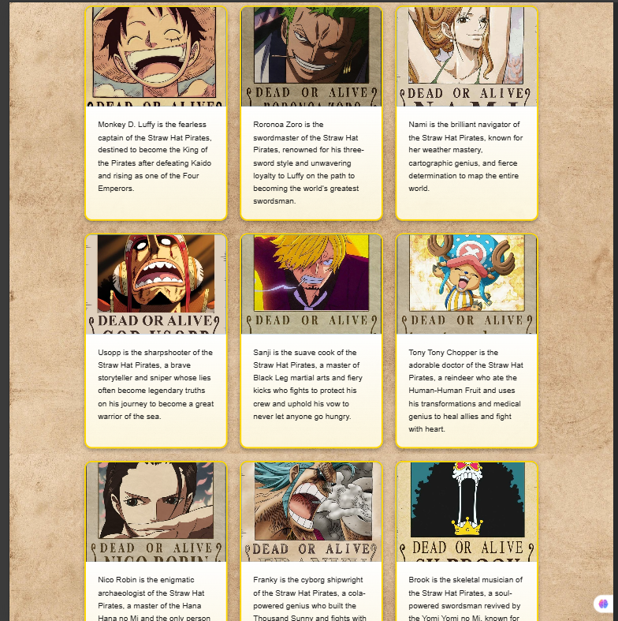
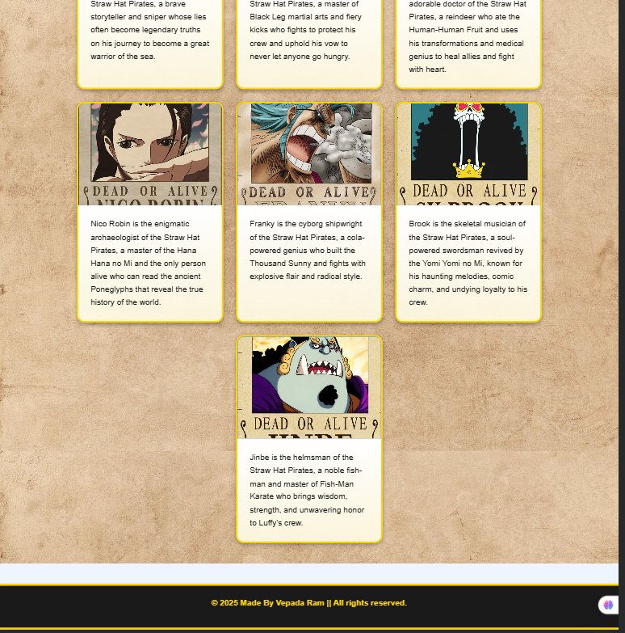

# ce8
Class Evaluation - 8 : Webpage Using Bootstrap 

<h1 align="center">📚 Class Evaluation - 8</h1>

  
  

---

## A Webpage Using only Bootstrap elements 

Welcome to my **Class Evaluation - 8** submission!  
This repository contains my work for the evaluation, showcasing my progress and learning.

---

## 🧾 Details

- **Name**: Bepara Ram Das
- **Student ID**: `04325105101038`
- **Project Type**: Class Evaluation Submission
- **Topic**: Responsive Webpage Using Bootstrap

---
## 🖼️ Preview / ScreenShot

---

## 📌 Notes

Feel free to explore, fork, or reach out if you have any feedback or questions!

---

  <i>Made  by Vepada</i>

